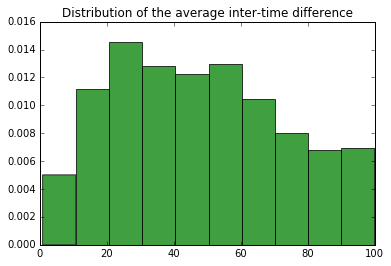
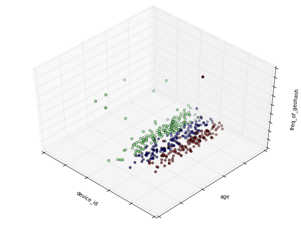
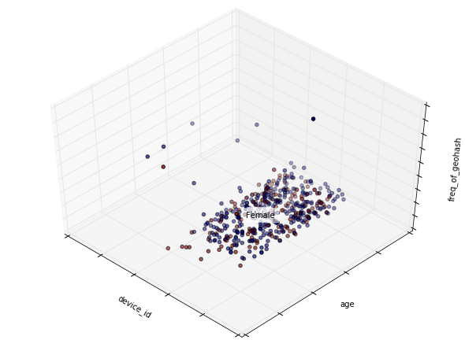
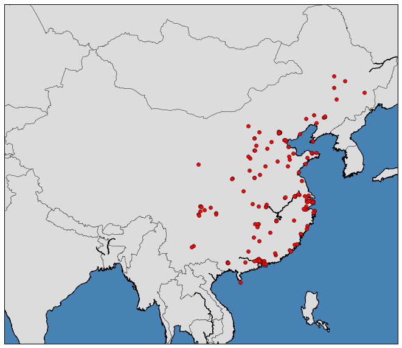

### Exploratory analysis for checking location information associated with events


```python
import pandas as pd
events = pd.read_csv('data/events.csv')
events['timestamp']=pd.to_datetime(events['timestamp'])
print (events.shape) # 3.3 million
```

    (3252950, 5)


```python
events.head()
```


<div>
<table border="1" class="dataframe">
  <thead>
    <tr style="text-align: right;">
      <th></th>
      <th>event_id</th>
      <th>device_id</th>
      <th>timestamp</th>
      <th>longitude</th>
      <th>latitude</th>
    </tr>
  </thead>
  <tbody>
    <tr>
      <th>0</th>
      <td>1</td>
      <td>29182687948017175</td>
      <td>2016-05-01 00:55:25</td>
      <td>121.38</td>
      <td>31.24</td>
    </tr>
    <tr>
      <th>1</th>
      <td>2</td>
      <td>-6401643145415154744</td>
      <td>2016-05-01 00:54:12</td>
      <td>103.65</td>
      <td>30.97</td>
    </tr>
    <tr>
      <th>2</th>
      <td>3</td>
      <td>-4833982096941402721</td>
      <td>2016-05-01 00:08:05</td>
      <td>106.60</td>
      <td>29.70</td>
    </tr>
    <tr>
      <th>3</th>
      <td>4</td>
      <td>-6815121365017318426</td>
      <td>2016-05-01 00:06:40</td>
      <td>104.27</td>
      <td>23.28</td>
    </tr>
    <tr>
      <th>4</th>
      <td>5</td>
      <td>-5373797595892518570</td>
      <td>2016-05-01 00:07:18</td>
      <td>115.88</td>
      <td>28.66</td>
    </tr>
  </tbody>
</table>
</div>


```python
# Sample it down to only the China region
lon_min, lon_max = 75, 135
lat_min, lat_max = 15, 55

# filter out those events triggered outside of China
events = events.query('longitude <= %d & %d <= longitude & latitude <= %d & %d <= latitude' %
                      (lon_max, lon_min, lat_max, lat_min))
print (events.shape) # 2.2 million
print (max(events.longitude), min(events.longitude))
print (max(events.latitude), min(events.latitude))
```

    (2202582, 5)
    134.3 75.86
    52.33 16.24


```python
events = events.set_index('timestamp')
events = events.sort_index()
```


```python
events.head()
```


<div>
<table border="1" class="dataframe">
  <thead>
    <tr style="text-align: right;">
      <th></th>
      <th>event_id</th>
      <th>device_id</th>
      <th>longitude</th>
      <th>latitude</th>
    </tr>
    <tr>
      <th>timestamp</th>
      <th></th>
      <th></th>
      <th></th>
      <th></th>
    </tr>
  </thead>
  <tbody>
    <tr>
      <th>2016-04-30 23:52:26</th>
      <td>2404700</td>
      <td>1779631023439405334</td>
      <td>114.25</td>
      <td>30.58</td>
    </tr>
    <tr>
      <th>2016-04-30 23:52:27</th>
      <td>1267793</td>
      <td>9032751590435469715</td>
      <td>114.76</td>
      <td>38.20</td>
    </tr>
    <tr>
      <th>2016-04-30 23:52:42</th>
      <td>421245</td>
      <td>-1945835327787113275</td>
      <td>104.67</td>
      <td>23.16</td>
    </tr>
    <tr>
      <th>2016-04-30 23:52:46</th>
      <td>2069706</td>
      <td>-2109240062444286231</td>
      <td>102.44</td>
      <td>24.90</td>
    </tr>
    <tr>
      <th>2016-04-30 23:53:05</th>
      <td>291992</td>
      <td>8189881002794531237</td>
      <td>121.34</td>
      <td>30.72</td>
    </tr>
  </tbody>
</table>
</div>


```python
#Function to generate geohashes for the devices
def find_geohash(data):
    import Geohash
    from Geohash import geohash
    grouped = data.groupby(['device_id'])
    import numpy as np
    for name, group in grouped:
        g=[],d=[]
        events1 = group.event_id
        lon = group.longitude
        lat = group.latitude
        for x in range(0,len(lat)):
            g.append(Geohash.encode(lat[x],lon[x]))
            d.append(name[x])
        geohash = pd.Series(g,index=events1.index)
        device = pd.Series(d,index=events1.index)
        df = pd.concat([device,events1,geohash], axis = 1)
        df.to_csv('data/'+str(name)+'_geohashes.csv')
```


```python
# Function to compute the length of trajectories for each device using Haversine formula
import math
def TrajLen(lon,lat):
    lon.reset_index(drop=True, inplace=True)
    lat.reset_index(drop=True, inplace=True)
    mat = pd.concat([lon,lat],axis = 1)
    n=int(mat.shape[0])
    M=[]
    radius = 6371
    for j in range(0,n-1):
        #val = sqrt((mat['longitude'][j+1]-mat['longitude'][j])**2 + (mat['latitude'][j+1]-mat['latitude'][j])**2)
        
        dlat = math.radians(mat['latitude'][j+1]-mat['latitude'][j])
        dlon = math.radians(mat['longitude'][j+1]-mat['longitude'][j])
        a = math.sin(dlat/2) * math.sin(dlat/2) + math.cos(math.radians(mat['latitude'][j])) \
            * math.cos(math.radians(mat['latitude'][j+1])) * math.sin(dlon/2) * math.sin(dlon/2)
        c = 2 * math.atan2(math.sqrt(a), math.sqrt(1-a))
        d = radius * c
        M.append(d)
    return sum(M)    
```


```python
# Function to compute the inter-time distribution between events for each device
def TimeDist(df):
    df1 = df.sort_index()
    df1['tvalue'] = df1.index
    df1['timediff'] = (df1['tvalue']-df1['tvalue'].shift()).fillna(0)
    df1['tdiff_mins'] = df1['timediff'].apply(lambda x: x / np.timedelta64(1,'m')).astype('int64') % (24*60)
    return df1
```


```python
#Group the events by device id and calculate time_diff and trajectory length for individual events 
#compute summary statistics on the time diff for each device_id
#df = pd.DataFrame()
#Also create the geohash index for lat,lon coordinates for each device id
'''device,min_td,max_td,avg_td,len_traj = [],[],[],[],[]
g = []
grouped = events.groupby(['device_id'])
import numpy as np
for name, group in grouped:
    events1 = group.event_id
    lon = group.longitude
    lat = group.latitude
    df = pd.concat([events1, lon, lat], axis=1)
    df1 = TimeDist(df)
    len_traj.append(TrajLen(lon,lat)) 
    device.append(name)
    min_td.append(min(df1['tdiff_mins']))
    max_td.append(max(df1['tdiff_mins']))
    avg_td.append(df1['tdiff_mins'].mean())
    #for x in range(0,len(lat)):
       # g.append(geohash.encode(lat[x],lon[x]))
    #df.append(df1)

df = pd.DataFrame(device)
df.columns = ['device_id']
df['min_td'] = min_td
df['max_td'] = max_td
df['avg_td'] = avg_td
df['traj_len'] = len_traj
#g.append(find_geohash(data))
#df['geohash'] = g'''
df.tail(7)
```


<div>
<table border="1" class="dataframe">
  <thead>
    <tr style="text-align: right;">
      <th></th>
      <th>device_id</th>
      <th>min_td</th>
      <th>max_td</th>
      <th>avg_td</th>
      <th>traj_len</th>
    </tr>
  </thead>
  <tbody>
    <tr>
      <th>29586</th>
      <td>9219164468944552013</td>
      <td>0</td>
      <td>482</td>
      <td>23.373464</td>
      <td>102.624237</td>
    </tr>
    <tr>
      <th>29587</th>
      <td>9219842210460037807</td>
      <td>0</td>
      <td>977</td>
      <td>244.750000</td>
      <td>20.234452</td>
    </tr>
    <tr>
      <th>29588</th>
      <td>9219937375310355234</td>
      <td>0</td>
      <td>1227</td>
      <td>124.692308</td>
      <td>10.007543</td>
    </tr>
    <tr>
      <th>29589</th>
      <td>9220562120895859549</td>
      <td>0</td>
      <td>1218</td>
      <td>174.111111</td>
      <td>100.973680</td>
    </tr>
    <tr>
      <th>29590</th>
      <td>9220914901466458680</td>
      <td>0</td>
      <td>1177</td>
      <td>396.000000</td>
      <td>10.052615</td>
    </tr>
    <tr>
      <th>29591</th>
      <td>9221586026451102237</td>
      <td>0</td>
      <td>1059</td>
      <td>76.948052</td>
      <td>137.195700</td>
    </tr>
    <tr>
      <th>29592</th>
      <td>9222355582733155698</td>
      <td>0</td>
      <td>1385</td>
      <td>37.729730</td>
      <td>0.000000</td>
    </tr>
  </tbody>
</table>
</div>


```python
import matplotlib.pyplot as plt
% matplotlib inline
df1 = df.query('traj_len>100 & traj_len<200')
#df2 = df1.ix[:1000,]
plt.hist(df1['traj_len'],normed=True,align='mid')
plt.title('Distribution of the trajectory length')
#df2
```


    <matplotlib.text.Text at 0x7f9eaac7af98>


#### Visualise the spatial distribution of the dataset


```python
import pandas as pd
events = pd.read_csv('data/events.csv')
events1 = events.loc[events['longitude']==0]
print(len(events1))
print(len(events1.loc[events1['latitude']==0]))
```

    968711
    968675


```python
%matplotlib inline
events.plot(kind = 'scatter', x = 'longitude', y = 'latitude', title = 'Spatial Distribution of events by Lat/Lon', figsize = [10,7])
```


    <matplotlib.axes._subplots.AxesSubplot at 0x7f8b4df34a58>


```python
import matplotlib.pyplot as plt
from mpl_toolkits.basemap import Basemap
%matplotlib inline
m1 = Basemap(projection='merc',
             llcrnrlat=-60,
             urcrnrlat=65,
             llcrnrlon=-180,
             urcrnrlon=180,
             lat_ts=0,
             resolution='c')

m1.fillcontinents(color='#bdbdbd',lake_color='#bdbdbd') 
m1.drawmapboundary(fill_color='#000000')                
m1.drawcountries(linewidth=0.1, color="#000000")              

# Plot the data
mxy = m1(events["longitude"].tolist(), events["latitude"].tolist())
m1.scatter(mxy[0], mxy[1], s=3, c="#feb24c", lw=0, alpha=1, zorder=5) 
plt.title("Geographic Distribution of Events")
plt.figure(figsize=(25,10))
plt.show()
```


    <matplotlib.figure.Figure at 0x7f8b41d9b3c8>


#### Visualise the temporal variations in the data


```python
import  matplotlib.pyplot as plt
%matplotlib inline
df2 = df1.query('avg_td>0 & avg_td<100')  # About 11227 devices have the time diff ranging from 0 to 100
plt.hist(df2['avg_td'],normed=1, facecolor='g', alpha=0.75,align = 'mid')
plt.title('Distribution of the average inter-time difference')
#print df2.shape
```


    <matplotlib.text.Text at 0x7f9eaac038d0>





```python
df3 = df1.query('traj_len >500')
plt.hist(df3['traj_len'])
print df3.shape
```

    (2013, 5)


### Find most frequently occurring geohashes using FPGrowth Model from Spark MLLib


```python
import pandas as pd
events = pd.read_csv('data/events.csv')
events['timestamp']=pd.to_datetime(events['timestamp'])

# Sample it down to only the China region
lon_min, lon_max = 75, 135
lat_min, lat_max = 15, 55

# filter out those events triggered outside of China
events = events.query('longitude <= %d & %d <= longitude & latitude <= %d & %d <= latitude' %
                      (lon_max, lon_min, lat_max, lat_min))
#Read the training data
train = pd.read_csv('data/gender_age_train.csv')

#join the training data with geohashes along with timestamp and construct an RDD
# Compute frequent itemset with FPGrowth Model from pyspark
train = train.set_index('device_id')
events = events.set_index('device_id')
data = events.join(train, how = 'right')
# Remove NA from data
data = data.dropna(how='any')
print (data.shape)
print (data.columns)
```

    (829216, 7)
    Index(['event_id', 'timestamp', 'longitude', 'latitude', 'gender', 'age',
           'group'],
          dtype='object')


```python
# Compute geohashes for each event from the lat,lon coordinates
import Geohash
from Geohash import geohash
g = []
lat = data["latitude"].tolist()
lon = data["longitude"].tolist()
for x in range(0,len(lat)):
    g.append(geohash.encode(lat[x],lon[x]))
data['geohash'] = g
data['device_id'] = data.index
data['timestamp'] = pd.to_datetime(data["timestamp"])
data['year'] = data.timestamp.map(lambda x: x.year)
data['month'] = data.timestamp.map(lambda x: x.month)
data['day'] = data.timestamp.map(lambda x: x.day)
data['hour'] = data.timestamp.map(lambda x: x.hour)
data['mins'] = data.timestamp.map(lambda x: x.minute)
data['sec'] = data.timestamp.map(lambda x: x.second)
data.head(5)
```


<div>
<table border="1" class="dataframe">
  <thead>
    <tr style="text-align: right;">
      <th></th>
      <th>event_id</th>
      <th>timestamp</th>
      <th>longitude</th>
      <th>latitude</th>
      <th>gender</th>
      <th>age</th>
      <th>group</th>
      <th>geohash</th>
      <th>device_id</th>
      <th>year</th>
      <th>month</th>
      <th>day</th>
      <th>hour</th>
      <th>mins</th>
      <th>sec</th>
    </tr>
    <tr>
      <th>device_id</th>
      <th></th>
      <th></th>
      <th></th>
      <th></th>
      <th></th>
      <th></th>
      <th></th>
      <th></th>
      <th></th>
      <th></th>
      <th></th>
      <th></th>
      <th></th>
      <th></th>
      <th></th>
    </tr>
  </thead>
  <tbody>
    <tr>
      <th>-9222956879900151005</th>
      <td>12679.0</td>
      <td>2016-05-07 12:18:35</td>
      <td>113.24</td>
      <td>23.19</td>
      <td>M</td>
      <td>36</td>
      <td>M32-38</td>
      <td>ws0ebvdge1rf</td>
      <td>-9222956879900151005</td>
      <td>2016</td>
      <td>5</td>
      <td>7</td>
      <td>12</td>
      <td>18</td>
      <td>35</td>
    </tr>
    <tr>
      <th>-9222956879900151005</th>
      <td>131849.0</td>
      <td>2016-05-07 12:06:35</td>
      <td>113.24</td>
      <td>23.19</td>
      <td>M</td>
      <td>36</td>
      <td>M32-38</td>
      <td>ws0ebvdge1rf</td>
      <td>-9222956879900151005</td>
      <td>2016</td>
      <td>5</td>
      <td>7</td>
      <td>12</td>
      <td>6</td>
      <td>35</td>
    </tr>
    <tr>
      <th>-9222956879900151005</th>
      <td>205471.0</td>
      <td>2016-05-06 15:36:46</td>
      <td>113.24</td>
      <td>23.19</td>
      <td>M</td>
      <td>36</td>
      <td>M32-38</td>
      <td>ws0ebvdge1rf</td>
      <td>-9222956879900151005</td>
      <td>2016</td>
      <td>5</td>
      <td>6</td>
      <td>15</td>
      <td>36</td>
      <td>46</td>
    </tr>
    <tr>
      <th>-9222956879900151005</th>
      <td>211711.0</td>
      <td>2016-05-06 21:26:14</td>
      <td>113.24</td>
      <td>23.19</td>
      <td>M</td>
      <td>36</td>
      <td>M32-38</td>
      <td>ws0ebvdge1rf</td>
      <td>-9222956879900151005</td>
      <td>2016</td>
      <td>5</td>
      <td>6</td>
      <td>21</td>
      <td>26</td>
      <td>14</td>
    </tr>
    <tr>
      <th>-9222956879900151005</th>
      <td>229069.0</td>
      <td>2016-05-06 15:34:19</td>
      <td>113.24</td>
      <td>23.19</td>
      <td>M</td>
      <td>36</td>
      <td>M32-38</td>
      <td>ws0ebvdge1rf</td>
      <td>-9222956879900151005</td>
      <td>2016</td>
      <td>5</td>
      <td>6</td>
      <td>15</td>
      <td>34</td>
      <td>19</td>
    </tr>
  </tbody>
</table>
</div>


```python
data.groupby('device_id')[['device_id','geohash','age','gender']].head()
```


<div>
<table border="1" class="dataframe">
  <thead>
    <tr style="text-align: right;">
      <th></th>
      <th>device_id</th>
      <th>geohash</th>
      <th>age</th>
      <th>gender</th>
    </tr>
    <tr>
      <th>device_id</th>
      <th></th>
      <th></th>
      <th></th>
      <th></th>
    </tr>
  </thead>
  <tbody>
    <tr>
      <th>-9222956879900151005</th>
      <td>-9222956879900151005</td>
      <td>ws0ebvdge1rf</td>
      <td>36</td>
      <td>M</td>
    </tr>
    <tr>
      <th>-9222956879900151005</th>
      <td>-9222956879900151005</td>
      <td>ws0ebvdge1rf</td>
      <td>36</td>
      <td>M</td>
    </tr>
    <tr>
      <th>-9222956879900151005</th>
      <td>-9222956879900151005</td>
      <td>ws0ebvdge1rf</td>
      <td>36</td>
      <td>M</td>
    </tr>
    <tr>
      <th>-9222956879900151005</th>
      <td>-9222956879900151005</td>
      <td>ws0ebvdge1rf</td>
      <td>36</td>
      <td>M</td>
    </tr>
    <tr>
      <th>-9222956879900151005</th>
      <td>-9222956879900151005</td>
      <td>ws0ebvdge1rf</td>
      <td>36</td>
      <td>M</td>
    </tr>
    <tr>
      <th>-9221026417907250887</th>
      <td>-9221026417907250887</td>
      <td>wt3rd7dqv1hd</td>
      <td>31</td>
      <td>F</td>
    </tr>
    <tr>
      <th>-9221026417907250887</th>
      <td>-9221026417907250887</td>
      <td>wt3rd7dqv1hd</td>
      <td>31</td>
      <td>F</td>
    </tr>
    <tr>
      <th>-9221026417907250887</th>
      <td>-9221026417907250887</td>
      <td>wt3rd7dqv1hd</td>
      <td>31</td>
      <td>F</td>
    </tr>
    <tr>
      <th>-9221026417907250887</th>
      <td>-9221026417907250887</td>
      <td>wt3rd7dqv1hd</td>
      <td>31</td>
      <td>F</td>
    </tr>
    <tr>
      <th>-9221026417907250887</th>
      <td>-9221026417907250887</td>
      <td>wt3rd7dqv1hd</td>
      <td>31</td>
      <td>F</td>
    </tr>
    <tr>
      <th>-9220061629197656378</th>
      <td>-9220061629197656378</td>
      <td>yb2c45m2svw5</td>
      <td>40</td>
      <td>M</td>
    </tr>
    <tr>
      <th>-9220061629197656378</th>
      <td>-9220061629197656378</td>
      <td>yb2c3h2gzy73</td>
      <td>40</td>
      <td>M</td>
    </tr>
    <tr>
      <th>-9220061629197656378</th>
      <td>-9220061629197656378</td>
      <td>yb2c38wz6yj0</td>
      <td>40</td>
      <td>M</td>
    </tr>
    <tr>
      <th>-9220061629197656378</th>
      <td>-9220061629197656378</td>
      <td>yb2c4jj6uvy0</td>
      <td>40</td>
      <td>M</td>
    </tr>
    <tr>
      <th>-9220061629197656378</th>
      <td>-9220061629197656378</td>
      <td>yb2c47k8tvwe</td>
      <td>40</td>
      <td>M</td>
    </tr>
    <tr>
      <th>-9218769147970107256</th>
      <td>-9218769147970107256</td>
      <td>wmpfsnkpndqv</td>
      <td>23</td>
      <td>M</td>
    </tr>
    <tr>
      <th>-9218769147970107256</th>
      <td>-9218769147970107256</td>
      <td>wmpfsnkpndqv</td>
      <td>23</td>
      <td>M</td>
    </tr>
    <tr>
      <th>-9218769147970107256</th>
      <td>-9218769147970107256</td>
      <td>wmpfsnkpndqv</td>
      <td>23</td>
      <td>M</td>
    </tr>
    <tr>
      <th>-9218769147970107256</th>
      <td>-9218769147970107256</td>
      <td>wmpfkm77z9xr</td>
      <td>23</td>
      <td>M</td>
    </tr>
    <tr>
      <th>-9218769147970107256</th>
      <td>-9218769147970107256</td>
      <td>wmpfkm77z9xr</td>
      <td>23</td>
      <td>M</td>
    </tr>
    <tr>
      <th>-9215352913819638805</th>
      <td>-9215352913819638805</td>
      <td>ws10ft4u4d4j</td>
      <td>18</td>
      <td>M</td>
    </tr>
    <tr>
      <th>-9215352913819638805</th>
      <td>-9215352913819638805</td>
      <td>ws10ft4u4d4j</td>
      <td>18</td>
      <td>M</td>
    </tr>
    <tr>
      <th>-9215352913819638805</th>
      <td>-9215352913819638805</td>
      <td>ws10ft4u4d4j</td>
      <td>18</td>
      <td>M</td>
    </tr>
    <tr>
      <th>-9215352913819638805</th>
      <td>-9215352913819638805</td>
      <td>ws10ft4u4d4j</td>
      <td>18</td>
      <td>M</td>
    </tr>
    <tr>
      <th>-9215352913819638805</th>
      <td>-9215352913819638805</td>
      <td>ws10ft4u4d4j</td>
      <td>18</td>
      <td>M</td>
    </tr>
    <tr>
      <th>-9212424538588397592</th>
      <td>-9212424538588397592</td>
      <td>ws0dw1fm6wh6</td>
      <td>23</td>
      <td>F</td>
    </tr>
    <tr>
      <th>-9212424538588397592</th>
      <td>-9212424538588397592</td>
      <td>ws0dw1fm6wh6</td>
      <td>23</td>
      <td>F</td>
    </tr>
    <tr>
      <th>-9212424538588397592</th>
      <td>-9212424538588397592</td>
      <td>ws0dw1fm6wh6</td>
      <td>23</td>
      <td>F</td>
    </tr>
    <tr>
      <th>-9212424538588397592</th>
      <td>-9212424538588397592</td>
      <td>ws0dw1fm6wh6</td>
      <td>23</td>
      <td>F</td>
    </tr>
    <tr>
      <th>-9212424538588397592</th>
      <td>-9212424538588397592</td>
      <td>ws0dw1fm6wh6</td>
      <td>23</td>
      <td>F</td>
    </tr>
    <tr>
      <th>...</th>
      <td>...</td>
      <td>...</td>
      <td>...</td>
      <td>...</td>
    </tr>
    <tr>
      <th>9203006693435653275</th>
      <td>9203006693435653275</td>
      <td>wx511cejtq2r</td>
      <td>27</td>
      <td>M</td>
    </tr>
    <tr>
      <th>9203006693435653275</th>
      <td>9203006693435653275</td>
      <td>wx511cejtq2r</td>
      <td>27</td>
      <td>M</td>
    </tr>
    <tr>
      <th>9203006693435653275</th>
      <td>9203006693435653275</td>
      <td>wx511cejtq2r</td>
      <td>27</td>
      <td>M</td>
    </tr>
    <tr>
      <th>9205029352332714761</th>
      <td>9205029352332714761</td>
      <td>ww3s3e53jtmf</td>
      <td>27</td>
      <td>M</td>
    </tr>
    <tr>
      <th>9205029352332714761</th>
      <td>9205029352332714761</td>
      <td>ww3s3e53jtmf</td>
      <td>27</td>
      <td>M</td>
    </tr>
    <tr>
      <th>9205029352332714761</th>
      <td>9205029352332714761</td>
      <td>ww3s6n9vxtwf</td>
      <td>27</td>
      <td>M</td>
    </tr>
    <tr>
      <th>9205029352332714761</th>
      <td>9205029352332714761</td>
      <td>ww3s3e53jtmf</td>
      <td>27</td>
      <td>M</td>
    </tr>
    <tr>
      <th>9205029352332714761</th>
      <td>9205029352332714761</td>
      <td>ww3s6n9vxtwf</td>
      <td>27</td>
      <td>M</td>
    </tr>
    <tr>
      <th>9215085115859659343</th>
      <td>9215085115859659343</td>
      <td>wxrvc7kbfsbk</td>
      <td>28</td>
      <td>M</td>
    </tr>
    <tr>
      <th>9215085115859659343</th>
      <td>9215085115859659343</td>
      <td>wxrvc7kbfsbk</td>
      <td>28</td>
      <td>M</td>
    </tr>
    <tr>
      <th>9215085115859659343</th>
      <td>9215085115859659343</td>
      <td>wxrvc7kbfsbk</td>
      <td>28</td>
      <td>M</td>
    </tr>
    <tr>
      <th>9215085115859659343</th>
      <td>9215085115859659343</td>
      <td>wxrvc7kbfsbk</td>
      <td>28</td>
      <td>M</td>
    </tr>
    <tr>
      <th>9215085115859659343</th>
      <td>9215085115859659343</td>
      <td>wxrvc7kbfsbk</td>
      <td>28</td>
      <td>M</td>
    </tr>
    <tr>
      <th>9216925254504446539</th>
      <td>9216925254504446539</td>
      <td>wttdpmth5x5t</td>
      <td>41</td>
      <td>M</td>
    </tr>
    <tr>
      <th>9216925254504446539</th>
      <td>9216925254504446539</td>
      <td>wttdpmth5x5t</td>
      <td>41</td>
      <td>M</td>
    </tr>
    <tr>
      <th>9216925254504446539</th>
      <td>9216925254504446539</td>
      <td>wttdpmth5x5t</td>
      <td>41</td>
      <td>M</td>
    </tr>
    <tr>
      <th>9216925254504446539</th>
      <td>9216925254504446539</td>
      <td>wttdpmth5x5t</td>
      <td>41</td>
      <td>M</td>
    </tr>
    <tr>
      <th>9216925254504446539</th>
      <td>9216925254504446539</td>
      <td>wttdp9urswuh</td>
      <td>41</td>
      <td>M</td>
    </tr>
    <tr>
      <th>9219164468944552013</th>
      <td>9219164468944552013</td>
      <td>wtmknw3pebyx</td>
      <td>35</td>
      <td>M</td>
    </tr>
    <tr>
      <th>9219164468944552013</th>
      <td>9219164468944552013</td>
      <td>wtmknw3pebyx</td>
      <td>35</td>
      <td>M</td>
    </tr>
    <tr>
      <th>9219164468944552013</th>
      <td>9219164468944552013</td>
      <td>wtmkq23cfcjg</td>
      <td>35</td>
      <td>M</td>
    </tr>
    <tr>
      <th>9219164468944552013</th>
      <td>9219164468944552013</td>
      <td>wtmknw3pebyx</td>
      <td>35</td>
      <td>M</td>
    </tr>
    <tr>
      <th>9219164468944552013</th>
      <td>9219164468944552013</td>
      <td>wtmknw3pebyx</td>
      <td>35</td>
      <td>M</td>
    </tr>
    <tr>
      <th>9219842210460037807</th>
      <td>9219842210460037807</td>
      <td>wk8qfey4py36</td>
      <td>29</td>
      <td>F</td>
    </tr>
    <tr>
      <th>9219842210460037807</th>
      <td>9219842210460037807</td>
      <td>wk8qfey4py36</td>
      <td>29</td>
      <td>F</td>
    </tr>
    <tr>
      <th>9219842210460037807</th>
      <td>9219842210460037807</td>
      <td>wk8rttkcv00q</td>
      <td>29</td>
      <td>F</td>
    </tr>
    <tr>
      <th>9219842210460037807</th>
      <td>9219842210460037807</td>
      <td>wk8qfey4py36</td>
      <td>29</td>
      <td>F</td>
    </tr>
    <tr>
      <th>9220914901466458680</th>
      <td>9220914901466458680</td>
      <td>wtu96sc6wbk4</td>
      <td>34</td>
      <td>M</td>
    </tr>
    <tr>
      <th>9220914901466458680</th>
      <td>9220914901466458680</td>
      <td>wtu9gemuecqt</td>
      <td>34</td>
      <td>M</td>
    </tr>
    <tr>
      <th>9220914901466458680</th>
      <td>9220914901466458680</td>
      <td>wtu9gemuecqt</td>
      <td>34</td>
      <td>M</td>
    </tr>
  </tbody>
</table>
<p>53138 rows × 4 columns</p>
</div>


```python
import pandas as pd
import numpy as np
import matplotlib.pyplot as plt
%matplotlib inline

x = pd.read_csv('data/events.csv')
device_groups = x.groupby('device_id')
# Number of people to show
i = 1500

# Threshold of number of data points for person to be included (excluding 0,0s)
thresh = 10

plt.figure(figsize=(15,10)) 
for g in device_groups:
    g = g[1]
    # Limit to china only
    g = g.loc[g.latitude > 18]
    g = g.loc[g.longitude > 80]
    if g.shape[0] > thresh:
        lon = g['longitude']
        lat = g['latitude']
        plt.plot(lon, lat, '-o', color=np.random.rand(3).tolist())
        i -= 1
    if i < 0:
        break
    
#plt.savefig('gps_map.png')"""
plt.show()
```


```python
# Setup Spark Instance 
import os
import sys

# For Linux
spark_home = os.environ.get('SPARK_HOME', None)
sys.path.append(spark_home + "/python")
sys.path.append(os.path.join(spark_home, 'python/lib/py4j-0.9-src.zip'))

filename = os.path.join(spark_home, 'python/pyspark/shell.py')
exec(compile(open(filename, "rb").read(), filename, 'exec'))

```

    Welcome to
          ____              __
         / __/__  ___ _____/ /__
        _\ \/ _ \/ _ `/ __/  '_/
       /__ / .__/\_,_/_/ /_/\_\   version 1.6.0
          /_/
    
    Using Python version 3.5.2 (default, Jul  2 2016 17:53:06)
    SparkContext available as sc, HiveContext available as sqlContext.


```python
# Create training dataset with a format that FPGrowthModel understands

train_data = data.loc[:,['geohash','device_id', 'age', 'gender', 'group']]
#train_data_F = data.loc[data['gender']=='F', ['geohash','device_id', 'age', 'gender', 'group']]
#train_data_M.to_csv('train_data_M.txt', sep=' ', index=False, header=False)
#train_data_F.to_csv('train_data_F.txt', sep=' ', index=False, header=False)
train_data.to_csv('training_data.txt', sep = ' ', index = False, header = False)

#Generate Frequent geohashes for different groups using Spark RDD with FPGrowthModel from Spark MLLib
from pyspark.mllib.fpm import FPGrowth

rdd = sc.textFile("training_data.txt")
transactions = rdd.map(lambda line: line.strip().split(' '))
unique = transactions.map(lambda x: list(set(x))).cache()
model = FPGrowth.train(unique, minSupport=0.00009, numPartitions=4)
result = model.freqItemsets().collect()
outfile = open('freqItemSets_train_data.txt', 'w')
for item in result:
    #print(type(item))
    outfile.write("%s\n" % str(item))
```


```python
# Pick the sets with freq>100 and parse it into a pandas data frame to apply LDA model for clustering
import re
text_file = open("freqItemSets_train_data.txt", "r")
freqitems = text_file.read().split('\n')
validitems = []
for item in freqitems:
    if len(item)>80:
        validitems.append(item)
        
print(len(freqitems),len(validitems))

freqsets = []
for item in validitems:
    # if the string matches the word 'freq' pick the value starting from '=' until ')'
    x = re.search("freq", item).end()
    
    # convert the extracted value to a number and check if it is > 100
    item1 = int(item[x+1:len(item)-1])
    #print(item1)
    if item1>100:
        freqsets.append(item)
print(freqsets[0])
```

    61671 7045
    FreqItemset(items=['6307601979756595263', 'wxrc5yhbj9y6', '25', 'M23-26'], freq=123)


```python
# Write all those freqitemsets which have geohash,device_id,age,gender and group combinations with freq > 100 to csv file
newitems = []
for item in freqsets:
    x = int(re.search("]",item).start())
    group = item[19:x]
    freq = item[x+8:len(item)-1]
    newitem = group + ', ' + freq
    newitems.append(newitem)
outfile = open('freqItemSets_freq_above_100_train_data.csv', 'w')
for item in newitems:
    if len(item)>63:
        outfile.write("%s\n" % str(item))
outfile.close()
print(newitems[0:5])
```

    ["'6307601979756595263', 'wxrc5yhbj9y6', '25', 'M23-26', 123", "'6307601979756595263', 'wxrc5yhbj9y6', '25', 'M23-26', 'M', 123", "'6307601979756595263', 'wxrc5yhbj9y6', 'M23-26', 'M', 123", "'wx4unxt5zn0f', '6216880192444765409', 'F29-32', '29', 155", "'wx4unxt5zn0f', '6216880192444765409', 'F29-32', '29', 'F', 155"]


```python
# For those items in the freqitemsets where device_id comes before geohash, swap the values
df = pd.read_csv('freqItemSets_freq_above_100_train_data.csv', header = None)
df1 = df   

#Format the string by removing extra spaces and quotes
df1[0] = df1[0].map(lambda x: x.lstrip(' \'').rstrip('\''))
df1[1] = df1[1].map(lambda x: x.lstrip(' \'').rstrip('\''))
df1[2] = df1[2].map(lambda x: x.lstrip(' \'').rstrip('\''))
df1[3]= df1[3].map(lambda x: x.lstrip(' \'').rstrip('\''))
df1[4]= df1[4].map(lambda x: x.lstrip(' \'').rstrip('\''))
df1.columns = ['geohash','device_id','age','group','gender','freq']

# Reshuffle geohash, device_id and age,group columns to synchronise the data
for i in range(0,len(df1)-1):
    if len(df1.iloc[i,0])>15:
        a = df1.iloc[i,0]
        b = df1.iloc[i,1]
        df1.iloc[i,0] = b
        df1.iloc[i,1] = a
    if len(df.iloc[i,2])>2:
        a1 = df1.iloc[i,2]
        b1 = df1.iloc[i,3]
        df1.iloc[i,2] = b1
        df1.iloc[i,3] = a1

#Convert the age and device_id columns to integer type and sort by frequency
df1['age'] = df1['age'].map(lambda x: int(x))
df1['device_id'] = df1['device_id'].map(lambda x: int(x))
print(type(df1['age'][0]),type(df1['device_id'][0]))
df1 = df1.sort_values(by = 'freq', inplace = False, axis = 0, ascending= False)
df1.head()
```

    <class 'numpy.int64'> <class 'numpy.int64'>


<div>
<table border="1" class="dataframe">
  <thead>
    <tr style="text-align: right;">
      <th></th>
      <th>geohash</th>
      <th>device_id</th>
      <th>age</th>
      <th>group</th>
      <th>gender</th>
      <th>freq</th>
    </tr>
  </thead>
  <tbody>
    <tr>
      <th>414</th>
      <td>wqptdu1xjj2s</td>
      <td>-8340098378141155823</td>
      <td>28</td>
      <td>M27-28</td>
      <td>M</td>
      <td>3745</td>
    </tr>
    <tr>
      <th>469</th>
      <td>wt3mbj1e4vp1</td>
      <td>1779631023439405334</td>
      <td>39</td>
      <td>F33-42</td>
      <td>F</td>
      <td>2233</td>
    </tr>
    <tr>
      <th>11</th>
      <td>wwc2kg4sb3f6</td>
      <td>4782582047729166353</td>
      <td>36</td>
      <td>M32-38</td>
      <td>M</td>
      <td>2126</td>
    </tr>
    <tr>
      <th>296</th>
      <td>wtb59r7wyjg5</td>
      <td>5098778421671837341</td>
      <td>38</td>
      <td>M32-38</td>
      <td>M</td>
      <td>2003</td>
    </tr>
    <tr>
      <th>81</th>
      <td>wqj5yccx13h1</td>
      <td>3074308677943390456</td>
      <td>24</td>
      <td>M23-26</td>
      <td>M</td>
      <td>1491</td>
    </tr>
  </tbody>
</table>
</div>


```python
# Assign numeric values to gender M := 0 and F := 1
for i in range(0,len(df1)):
    if df1.iloc[i,4] == 'M':
        df1.iloc[i,4] = 0
    else:
        df1.iloc[i,4] = 1
df1.head()
```


<div>
<table border="1" class="dataframe">
  <thead>
    <tr style="text-align: right;">
      <th></th>
      <th>geohash</th>
      <th>device_id</th>
      <th>age</th>
      <th>group</th>
      <th>gender</th>
      <th>freq</th>
    </tr>
  </thead>
  <tbody>
    <tr>
      <th>414</th>
      <td>wqptdu1xjj2s</td>
      <td>-8340098378141155823</td>
      <td>28</td>
      <td>M27-28</td>
      <td>0</td>
      <td>3745</td>
    </tr>
    <tr>
      <th>469</th>
      <td>wt3mbj1e4vp1</td>
      <td>1779631023439405334</td>
      <td>39</td>
      <td>F33-42</td>
      <td>1</td>
      <td>2233</td>
    </tr>
    <tr>
      <th>11</th>
      <td>wwc2kg4sb3f6</td>
      <td>4782582047729166353</td>
      <td>36</td>
      <td>M32-38</td>
      <td>0</td>
      <td>2126</td>
    </tr>
    <tr>
      <th>296</th>
      <td>wtb59r7wyjg5</td>
      <td>5098778421671837341</td>
      <td>38</td>
      <td>M32-38</td>
      <td>0</td>
      <td>2003</td>
    </tr>
    <tr>
      <th>81</th>
      <td>wqj5yccx13h1</td>
      <td>3074308677943390456</td>
      <td>24</td>
      <td>M23-26</td>
      <td>0</td>
      <td>1491</td>
    </tr>
  </tbody>
</table>
</div>


```python
#Assign numeric values to groups
print(df1['group'].unique())
for i in range(0,len(df1)):
    if df1.iloc[i,3] == 'M23-26':
        df1.iloc[i,3] = 1
    elif df1.iloc[i,3] == 'M27-28':
        df1.iloc[i,3] = 2
    elif df1.iloc[i,3] == 'M29-31':
        df1.iloc[i,3] = 3
    elif df1.iloc[i,3] == 'M32-38':
        df1.iloc[i,3] = 4
    elif df1.iloc[i,3] == 'F24-26':
        df1.iloc[i,3] = 5
    elif df1.iloc[i,3] == 'F27-28':
        df1.iloc[i,3] = 6
    elif df1.iloc[i,3] == 'F29-32':
        df1.iloc[i,3] = 7
    elif df1.iloc[i,3] == 'F33-42':
        df1.iloc[i,3] = 8
df1.head()
```

    ['M27-28' 'F33-42' 'M32-38' 'M23-26' 'F27-28' 'M29-31' 'F29-32' 'F24-26']


<div>
<table border="1" class="dataframe">
  <thead>
    <tr style="text-align: right;">
      <th></th>
      <th>geohash</th>
      <th>device_id</th>
      <th>age</th>
      <th>group</th>
      <th>gender</th>
      <th>freq</th>
    </tr>
  </thead>
  <tbody>
    <tr>
      <th>414</th>
      <td>wqptdu1xjj2s</td>
      <td>-8340098378141155823</td>
      <td>28</td>
      <td>2</td>
      <td>0</td>
      <td>3745</td>
    </tr>
    <tr>
      <th>469</th>
      <td>wt3mbj1e4vp1</td>
      <td>1779631023439405334</td>
      <td>39</td>
      <td>8</td>
      <td>1</td>
      <td>2233</td>
    </tr>
    <tr>
      <th>11</th>
      <td>wwc2kg4sb3f6</td>
      <td>4782582047729166353</td>
      <td>36</td>
      <td>4</td>
      <td>0</td>
      <td>2126</td>
    </tr>
    <tr>
      <th>296</th>
      <td>wtb59r7wyjg5</td>
      <td>5098778421671837341</td>
      <td>38</td>
      <td>4</td>
      <td>0</td>
      <td>2003</td>
    </tr>
    <tr>
      <th>81</th>
      <td>wqj5yccx13h1</td>
      <td>3074308677943390456</td>
      <td>24</td>
      <td>1</td>
      <td>0</td>
      <td>1491</td>
    </tr>
  </tbody>
</table>
</div>


```python
df1.to_csv('formatted_freqItemSets_train.csv', index = False)
```


```python
import pandas as pd
df_FPG = pd.read_csv('formatted_freqItemSets_train.csv')
print(df_FPG.shape[0])
df_FPG.head()
```

    494


<div>
<table border="1" class="dataframe">
  <thead>
    <tr style="text-align: right;">
      <th></th>
      <th>geohash</th>
      <th>device_id</th>
      <th>age</th>
      <th>group</th>
      <th>gender</th>
      <th>freq</th>
    </tr>
  </thead>
  <tbody>
    <tr>
      <th>0</th>
      <td>wqptdu1xjj2s</td>
      <td>-8340098378141155823</td>
      <td>28</td>
      <td>2</td>
      <td>0</td>
      <td>3745</td>
    </tr>
    <tr>
      <th>1</th>
      <td>wt3mbj1e4vp1</td>
      <td>1779631023439405334</td>
      <td>39</td>
      <td>8</td>
      <td>1</td>
      <td>2233</td>
    </tr>
    <tr>
      <th>2</th>
      <td>wwc2kg4sb3f6</td>
      <td>4782582047729166353</td>
      <td>36</td>
      <td>4</td>
      <td>0</td>
      <td>2126</td>
    </tr>
    <tr>
      <th>3</th>
      <td>wtb59r7wyjg5</td>
      <td>5098778421671837341</td>
      <td>38</td>
      <td>4</td>
      <td>0</td>
      <td>2003</td>
    </tr>
    <tr>
      <th>4</th>
      <td>wqj5yccx13h1</td>
      <td>3074308677943390456</td>
      <td>24</td>
      <td>1</td>
      <td>0</td>
      <td>1491</td>
    </tr>
  </tbody>
</table>
</div>


#### Linear Discriminant Analysis to cluster the geohashes based on gender


```python
# features : device_id, geohash, age, gender,frequency of geohashes
# groups : ['M23-26', 'M27-28', 'M29-31', 'M32-38', 'F24-26', 'F27-28', 'F29-32', 'F33-42']
# numbers assigned to groups : [1,2,3,4,5,6,7,8]
# gender : M ==> 0 , F ==> 1

import numpy as np
from sklearn.lda import LDA
from sklearn.cross_validation import train_test_split


#Prepare the dataset for fitting to LDA model

X = df_FPG[['device_id','age','freq','group']].values
y = np.array(df_FPG['gender'].tolist())
X_train, X_test, y_train, y_test = train_test_split(X, y, test_size=.4)
# Invoke LDA model from scikit-learn 
clf = LDA(store_covariance = True)
# Fit the data to LDA model
fit = clf.fit(X_train,y_train)
# Covariance matrix (shared by all classes)
cov_mat = fit.covariance_
# Predict confidence scores for samples.
decision_func = fit.decision_function(X_test)

print(cov_mat)
print(decision_func)
```

    [[  6.05e+36   4.79e+17   1.31e+20   6.35e+16]
     [  4.79e+17   1.88e+01   1.46e+02   4.63e+00]
     [  1.31e+20   1.46e+02   5.26e+04   2.78e+01]
     [  6.35e+16   4.63e+00   2.78e+01   1.35e+00]]
    [-40.88 -35.09  32.81 -49.62  47.26  32.92 -49.65 -41.08  28.99 -40.46
     -35.46 -26.36 -36.07  32.88 -25.8  -42.94 -26.18  46.82 -49.17  33.41
     -41.08  38.04  47.54 -34.71  38.42 -31.19 -26.67 -43.91 -45.48  28.01
      37.41 -35.63  24.4   37.55 -39.96  42.51 -30.79  37.76 -25.68 -35.73
     -26.45 -30.21  38.04 -50.53 -26.76  38.9  -36.29 -31.08 -35.31  47.84
     -41.14  24.58 -31.5   33.73 -39.92  32.85 -49.77 -40.04 -40.11 -36.36
      42.77 -50.13 -36.15  46.95 -21.88 -36.35  33.11 -35.93 -35.04 -30.62
     -35.05 -35.54 -35.78 -40.55  37.38 -25.88 -34.8  -49.98  33.21 -35.29
     -31.22 -40.9  -36.14 -36.3  -40.12 -34.1  -40.31 -49.12  48.94  42.54
     -27.27 -25.61  43.21  33.43  37.83 -31.15 -35.75 -25.63  37.19  43.16
     -35.06  33.53 -30.7  -33.48  23.82 -38.8  -26.98 -40.06 -36.58 -39.39
     -44.54  43.07 -27.05  34.47 -39.87  28.57 -25.99  42.76 -45.71 -30.98
     -26.4   38.64  38.33  46.78  38.   -36.15 -40.5   33.22 -40.04  28.71
     -44.78  32.81  28.13 -45.01  10.53 -26.11 -21.59 -35.81  47.15 -44.87
     -22.13 -31.46 -30.67 -36.05 -30.3  -45.9   33.99  23.95 -40.19  24.43
     -36.72  46.71 -36.55  33.8  -50.11 -40.88 -40.78  42.87  24.3  -35.07
     -35.34 -40.87  38.75 -35.44 -35.69 -30.68 -40.65 -26.73 -36.13  15.53
     -35.96 -34.84 -26.67  11.23 -40.4  -49.34  38.54 -40.18 -49.52  19.09
     -30.34  47.28 -26.12 -40.45 -44.79 -39.37 -33.8  -30.64 -49.39 -31.33 -50.
     -31.8   33.28 -26.36 -41.23 -41.   -46.09 -35.53]


```python
# Predict values for the test dataset
print(clf.predict(X_test))
print(clf.predict_proba(X_test))
```

    [0 0 0 0 0 1 1 0 0 0 0 0 0 1 1 1 1 0 1 0 1 1 0 0 0 1 1 0 0 0 1 0 1 0 0 0 0
     0 1 0 1 0 1 0 0 0 0 0 0 0 0 0 1 0 0 0 1 0 0 0 0 0 0 0 1 0 0 1 0 0 1 0 1 1
     0 0 1 0 1 1 1 0 0 0 0 1 1 0 0 0 0 0 0 0 0 0 0 1 1 1 1 0 0 1 0 0 0 0 0 0 0
     0 1 0 0 0 0 0 1 0 1 0 1 0 0 1 0 0 1 0 0 1 0 0 0 0 0 0 0 0 0 1 1 1 1 0 0 0
     1 0 0 0 0 0 0 0 0 0 0 1 1 0 1 0 0 0 0 1 0 1 0 0 1 0 1 0 0 0 0 1 0 0 1 0 1
     1 0 1 0 1 0 0 1 0 1 0 0 0]
    [[  1.00000000e+00   2.06231037e-23]
     [  1.00000000e+00   4.49926417e-17]
     [  1.00000000e+00   5.00400624e-17]
     [  1.00000000e+00   3.56995012e-19]
     [  1.00000000e+00   2.40354094e-21]
     [  8.88178420e-16   1.00000000e+00]
     [  0.00000000e+00   1.00000000e+00]
     [  1.00000000e+00   1.18756436e-10]
     [  1.00000000e+00   5.81431600e-13]
     [  1.00000000e+00   4.43046016e-19]
     [  1.00000000e+00   5.14742641e-17]
     [  1.00000000e+00   3.09401185e-21]
     [  1.00000000e+00   4.89322340e-19]
     [  0.00000000e+00   1.00000000e+00]
     [  6.66133815e-16   1.00000000e+00]
     [  6.66133815e-16   1.00000000e+00]
     [  1.26121336e-13   1.00000000e+00]
     [  1.00000000e+00   7.75233756e-13]
     [  6.66133815e-16   1.00000000e+00]
     [  1.00000000e+00   3.93946016e-19]
     [  0.00000000e+00   1.00000000e+00]
     [  0.00000000e+00   1.00000000e+00]
     [  1.00000000e+00   8.53095926e-15]
     [  1.00000000e+00   7.49449256e-11]
     [  1.00000000e+00   4.30590688e-17]
     [  1.24344979e-13   1.00000000e+00]
     [  0.00000000e+00   1.00000000e+00]
     [  1.00000000e+00   6.84620285e-13]
     [  1.00000000e+00   4.20689427e-17]
     [  1.00000000e+00   2.38155242e-23]
     [  6.66133815e-16   1.00000000e+00]
     [  1.00000000e+00   8.33163780e-13]
     [  1.00888187e-11   1.00000000e+00]
     [  1.00000000e+00   3.70960981e-17]
     [  1.00000000e+00   9.02682527e-13]
     [  1.00000000e+00   3.66337386e-19]
     [  1.00000000e+00   6.99337558e-15]
     [  1.00000000e+00   2.54240632e-19]
     [  0.00000000e+00   1.00000000e+00]
     [  1.00000000e+00   1.69066572e-23]
     [  0.00000000e+00   1.00000000e+00]
     [  1.00000000e+00   3.47019729e-19]
     [  8.88178420e-16   1.00000000e+00]
     [  1.00000000e+00   9.67664648e-13]
     [  1.00000000e+00   8.78451173e-13]
     [  1.00000000e+00   2.55648385e-23]
     [  1.00000000e+00   3.33386605e-19]
     [  1.00000000e+00   5.49721878e-13]
     [  1.00000000e+00   2.55348274e-23]
     [  1.00000000e+00   2.85471688e-19]
     [  1.00000000e+00   5.10546149e-15]
     [  1.00000000e+00   5.00507085e-15]
     [  0.00000000e+00   1.00000000e+00]
     [  1.00000000e+00   3.47513846e-19]
     [  1.00000000e+00   4.37215187e-19]
     [  1.00000000e+00   4.45842308e-17]
     [  0.00000000e+00   1.00000000e+00]
     [  1.00000000e+00   4.47763102e-17]
     [  1.00000000e+00   6.85992249e-13]
     [  1.00000000e+00   2.93028722e-21]
     [  1.00000000e+00   3.19360437e-19]
     [  1.00000000e+00   6.80537031e-13]
     [  1.00000000e+00   9.20641538e-11]
     [  1.00000000e+00   5.68982071e-19]
     [  9.01265063e-10   9.99999999e-01]
     [  1.00000000e+00   2.99007607e-23]
     [  1.00000000e+00   2.21287454e-23]
     [  1.19582122e-11   1.00000000e+00]
     [  1.00000000e+00   3.63168515e-21]
     [  1.00000000e+00   8.04117587e-15]
     [  0.00000000e+00   1.00000000e+00]
     [  1.00000000e+00   7.08852578e-13]
     [  1.36457956e-10   1.00000000e+00]
     [  0.00000000e+00   1.00000000e+00]
     [  1.00000000e+00   4.57481146e-17]
     [  1.00000000e+00   2.75277466e-19]
     [  0.00000000e+00   1.00000000e+00]
     [  1.00000000e+00   3.83780636e-17]
     [  6.66133815e-16   1.00000000e+00]
     [  0.00000000e+00   1.00000000e+00]
     [  0.00000000e+00   1.00000000e+00]
     [  1.00000000e+00   3.28836263e-19]
     [  1.00000000e+00   3.91786840e-19]
     [  1.00000000e+00   3.07213389e-21]
     [  1.00000000e+00   8.72666357e-11]
     [  0.00000000e+00   1.00000000e+00]
     [  1.38857814e-11   1.00000000e+00]
     [  1.00000000e+00   3.67328987e-19]
     [  1.00000000e+00   4.88636456e-17]
     [  1.00000000e+00   5.28259739e-17]
     [  1.00000000e+00   5.03941328e-17]
     [  1.00000000e+00   6.86561068e-18]
     [  1.00000000e+00   9.52194849e-13]
     [  1.00000000e+00   4.74030376e-17]
     [  1.00000000e+00   3.42056157e-19]
     [  1.00000000e+00   2.18360224e-23]
     [  1.00000000e+00   3.18660236e-17]
     [  6.66133815e-16   1.00000000e+00]
     [  1.55131258e-05   9.99984487e-01]
     [  6.66133815e-16   1.00000000e+00]
     [  0.00000000e+00   1.00000000e+00]
     [  1.00000000e+00   6.88827106e-15]
     [  1.00000000e+00   2.95390972e-19]
     [  6.66133815e-16   1.00000000e+00]
     [  1.00000000e+00   4.37741984e-17]
     [  1.00000000e+00   5.12147933e-17]
     [  1.00000000e+00   2.78998987e-19]
     [  1.00000000e+00   3.36062432e-19]
     [  1.00000000e+00   3.48855535e-17]
     [  1.00000000e+00   2.82330203e-21]
     [  1.00000000e+00   3.30516443e-21]
     [  1.00000000e+00   5.89790320e-13]
     [  8.88178420e-16   1.00000000e+00]
     [  1.00000000e+00   5.06037607e-17]
     [  1.00000000e+00   3.83054571e-17]
     [  1.00000000e+00   3.83133954e-19]
     [  1.00000000e+00   5.04324999e-17]
     [  1.00000000e+00   5.42448634e-15]
     [  0.00000000e+00   1.00000000e+00]
     [  1.00000000e+00   4.03203727e-17]
     [  1.04813935e-11   1.00000000e+00]
     [  1.00000000e+00   3.86343856e-19]
     [  0.00000000e+00   1.00000000e+00]
     [  1.00000000e+00   6.79770387e-15]
     [  1.00000000e+00   3.20227378e-19]
     [  1.06314957e-11   1.00000000e+00]
     [  1.00000000e+00   2.86139688e-19]
     [  1.00000000e+00   6.06427772e-13]
     [  1.38411994e-07   9.99999862e-01]
     [  1.00000000e+00   3.01944258e-23]
     [  1.00000000e+00   1.67286136e-23]
     [  0.00000000e+00   1.00000000e+00]
     [  1.00000000e+00   3.29299952e-21]
     [  1.00000000e+00   4.91040887e-17]
     [  1.00000000e+00   6.31329939e-13]
     [  1.00000000e+00   1.42195239e-10]
     [  1.00000000e+00   4.37954910e-19]
     [  1.00000000e+00   6.61164883e-13]
     [  1.00000000e+00   4.43421122e-17]
     [  1.00000000e+00   4.66708003e-17]
     [  1.00000000e+00   3.98569996e-17]
     [  8.88178420e-16   1.00000000e+00]
     [  1.45838897e-11   1.00000000e+00]
     [  8.88178420e-16   1.00000000e+00]
     [  8.17124146e-14   1.00000000e+00]
     [  1.00000000e+00   4.33235765e-17]
     [  1.00000000e+00   7.42533767e-13]
     [  1.00000000e+00   2.33601311e-23]
     [  1.11022302e-15   1.00000000e+00]
     [  1.00000000e+00   2.87324827e-23]
     [  1.00000000e+00   8.35083857e-11]
     [  1.00000000e+00   6.09363004e-17]
     [  1.00000000e+00   4.95382190e-17]
     [  1.00000000e+00   5.77157230e-17]
     [  1.00000000e+00   4.03844977e-19]
     [  1.00000000e+00   3.06503497e-19]
     [  1.00000000e+00   4.86222507e-21]
     [  1.00000000e+00   5.03514066e-17]
     [  1.00000000e+00   4.71210931e-17]
     [  8.68194405e-14   1.00000000e+00]
     [  1.27897692e-13   1.00000000e+00]
     [  1.00000000e+00   4.12238654e-17]
     [  0.00000000e+00   1.00000000e+00]
     [  1.00000000e+00   3.17993674e-19]
     [  1.00000000e+00   7.87490100e-17]
     [  1.00000000e+00   2.76228643e-21]
     [  1.00000000e+00   1.92015504e-23]
     [  8.88178420e-16   1.00000000e+00]
     [  1.00000000e+00   2.07881593e-21]
     [  1.60389877e-05   9.99983961e-01]
     [  1.00000000e+00   1.46932722e-18]
     [  1.00000000e+00   5.76584362e-17]
     [  6.66133815e-16   1.00000000e+00]
     [  1.00000000e+00   3.42052880e-17]
     [  8.74855743e-14   1.00000000e+00]
     [  1.00000000e+00   2.42701777e-21]
     [  1.00000000e+00   7.99605109e-11]
     [  1.00000000e+00   5.30841409e-19]
     [  1.00000000e+00   4.82083982e-17]
     [  0.00000000e+00   1.00000000e+00]
     [  1.00000000e+00   9.28849730e-17]
     [  1.00000000e+00   3.30186158e-21]
     [  0.00000000e+00   1.00000000e+00]
     [  1.00000000e+00   6.93412271e-15]
     [  0.00000000e+00   1.00000000e+00]
     [  0.00000000e+00   1.00000000e+00]
     [  1.00000000e+00   7.98211763e-15]
     [  0.00000000e+00   1.00000000e+00]
     [  1.00000000e+00   9.53199176e-13]
     [  0.00000000e+00   1.00000000e+00]
     [  1.00000000e+00   2.91418323e-23]
     [  1.00000000e+00   8.70984478e-17]
     [  0.00000000e+00   1.00000000e+00]
     [  1.00000000e+00   4.23337705e-19]
     [  1.24198429e-11   1.00000000e+00]
     [  1.00000000e+00   3.15077995e-19]
     [  1.00000000e+00   6.42182705e-15]
     [  1.00000000e+00   8.08776744e-13]]


```python
clf.fit_transform(X_train,y_train)
```


    array([[-2.65750656],
           [ 6.90892099],
           [ 5.75614489],
           [-1.5060264 ],
           [ 5.78295056],
           [-3.17650123],
           [-4.35210215],
           [-3.23470065],
           [-2.08048603],
           [-2.63286251],
           [-4.35143089],
           [-2.07799665],
           [-2.06834997],
           [-2.67314734],
           [ 6.8930624 ],
           [-3.73490435],
           [-0.97214447],
           [ 2.98109321],
           [-1.53350598],
           [-3.20133213],
           [-3.73309706],
           [-3.79126588],
           [-2.06259609],
           [-2.65274083],
           [ 7.46651157],
           [-2.63294017],
           [ 5.80084102],
           [-2.61801478],
           [ 6.88575382],
           [-0.9411737 ],
           [-3.19724168],
           [ 6.89842107],
           [-3.80718887],
           [-2.01162369],
           [-1.5184566 ],
           [-2.66546277],
           [-2.67661497],
           [-4.32549897],
           [-3.22787439],
           [-2.61728712],
           [-1.53010831],
           [-1.54011397],
           [-4.35817712],
           [-2.66049912],
           [ 6.29760288],
           [-2.61338992],
           [-3.78146074],
           [-3.18514323],
           [-3.01346221],
           [ 5.23330681],
           [ 5.17279315],
           [-2.07487929],
           [ 6.31916282],
           [-1.51306949],
           [-4.31773091],
           [-1.54952395],
           [ 5.23279941],
           [-2.66316037],
           [-3.22442044],
           [-3.78569175],
           [ 4.62629005],
           [-2.07676563],
           [ 5.21478288],
           [-1.45999484],
           [ 5.23178916],
           [-4.30802506],
           [-1.54102973],
           [-1.4995061 ],
           [ 6.31112602],
           [ 4.07476305],
           [-2.08679941],
           [-2.08101124],
           [-2.07261618],
           [ 7.45129845],
           [-2.06611612],
           [ 4.64575729],
           [-2.66476919],
           [-2.10864645],
           [-3.23680726],
           [ 6.9007613 ],
           [-3.19819839],
           [-1.51795225],
           [ 5.18784069],
           [-3.74533245],
           [ 7.42341972],
           [-1.55949446],
           [-2.07096634],
           [-3.7210326 ],
           [ 5.73251198],
           [ 5.75342057],
           [-3.75245829],
           [-2.63599836],
           [-3.77735969],
           [ 6.30724479],
           [ 5.19132671],
           [-2.66790476],
           [ 7.43125379],
           [-1.52178173],
           [ 2.44559817],
           [-1.54418913],
           [-0.93996822],
           [-2.65946149],
           [-2.63676026],
           [-3.21391016],
           [-1.53201169],
           [-2.09516372],
           [ 5.18872793],
           [ 7.44586641],
           [ 6.29707073],
           [ 5.73825331],
           [-3.2111511 ],
           [-1.50189763],
           [ 5.27986665],
           [-2.67800589],
           [ 6.3242834 ],
           [-3.18443061],
           [-1.54782893],
           [-2.09428391],
           [-4.1970757 ],
           [-2.61718278],
           [-1.49633369],
           [-3.7413273 ],
           [-3.19840655],
           [-3.20933744],
           [-3.16761379],
           [-2.04988359],
           [ 6.34743436],
           [-2.06159875],
           [ 5.76325553],
           [-4.30074531],
           [-1.54305201],
           [ 5.73708283],
           [-0.94826328],
           [ 7.44682504],
           [ 5.20809256],
           [-0.96841001],
           [-3.78235885],
           [ 6.2956243 ],
           [-1.50554174],
           [-4.33382296],
           [-3.20677467],
           [-2.93257282],
           [ 4.62792937],
           [-3.17324284],
           [-1.52124023],
           [ 5.80118691],
           [ 5.76926507],
           [-2.06191395],
           [-3.67838541],
           [ 6.29339142],
           [-2.6734547 ],
           [-3.20638072],
           [-2.0643248 ],
           [ 4.62544576],
           [-2.67615497],
           [-1.50223354],
           [-2.65868036],
           [-2.64951834],
           [-4.3324389 ],
           [ 5.73905942],
           [-1.50203097],
           [ 7.47184526],
           [-2.07984458],
           [-2.10414356],
           [-2.08123994],
           [-3.18588175],
           [-1.50944689],
           [ 5.87793206],
           [ 5.73994086],
           [-3.76673891],
           [ 5.76233241],
           [-1.51134191],
           [-4.33184508],
           [ 4.10818711],
           [-1.53757488],
           [-4.35039334],
           [ 6.34037549],
           [-4.28619971],
           [-3.74049576],
           [-2.66294242],
           [-4.05939349],
           [-4.36680046],
           [-3.77580963],
           [-2.67828889],
           [-2.65299484],
           [-3.74216657],
           [-2.00639038],
           [-3.8066784 ],
           [ 5.79264881],
           [-2.50121587],
           [-2.63606277],
           [-2.66918045],
           [-2.08628821],
           [-1.52063166],
           [ 4.66706303],
           [-2.61177818],
           [-3.23322403],
           [-0.95835552],
           [-2.66579759],
           [ 5.2267783 ],
           [ 5.75921069],
           [-0.93415732],
           [-1.52624128],
           [-4.35333907],
           [-2.65356974],
           [-1.54737322],
           [-2.61053658],
           [ 7.51345613],
           [ 6.33033265],
           [-0.92551898],
           [ 5.16641734],
           [ 4.60366997],
           [-3.22199079],
           [-2.67414678],
           [-2.04643828],
           [-4.31067117],
           [ 6.33238567],
           [ 4.64498743],
           [-3.2024951 ],
           [-2.66735922],
           [-4.36940158],
           [ 6.94676296],
           [ 7.43758456],
           [-2.66900315],
           [ 4.62708362],
           [-1.51722368],
           [-2.60237292],
           [-3.76436092],
           [-4.32324928],
           [ 7.45981632],
           [-3.71609791],
           [-2.65011205],
           [ 7.45225909],
           [-1.54759796],
           [-1.51952711],
           [ 5.75062595],
           [ 6.31030296],
           [-2.66195139],
           [-2.62752419],
           [-3.79953222],
           [-2.08460707],
           [-2.63367189],
           [ 6.30693683],
           [-4.29617904],
           [-3.21670173],
           [-0.96747444],
           [ 6.29817822],
           [-2.09126932],
           [ 7.47038994],
           [ 5.78736138],
           [-1.49760625],
           [-4.34341712],
           [-2.08478999],
           [-2.65480383],
           [-2.6382835 ],
           [ 3.01256812],
           [ 7.45581923],
           [-3.2034517 ],
           [-2.04346971],
           [ 5.76534113],
           [ 5.22476221],
           [-1.54969605],
           [ 5.77959408],
           [-1.50844591],
           [ 6.8945022 ],
           [-3.16075301],
           [-1.43609318],
           [-1.52468371],
           [ 5.23125856],
           [-3.78125234],
           [-4.33066795],
           [-3.23995355],
           [-3.22712898],
           [-3.18547785],
           [ 6.32683239],
           [ 5.18565771],
           [ 7.43999769],
           [-2.60656709],
           [ 5.76082616],
           [-3.19419456],
           [-3.12663958],
           [ 6.34412971],
           [-3.18882133],
           [-2.69136602],
           [-0.9821111 ],
           [-4.35076004],
           [ 7.44676368],
           [-3.22795387],
           [-2.64529493],
           [ 7.45444207],
           [ 6.3523727 ],
           [-3.72545161],
           [ 5.20333156],
           [ 6.87943408],
           [-2.66814777],
           [-2.04874894]])


```python
plt.scatter(X_train[:,0],y_train)
```


    <matplotlib.collections.PathCollection at 0x7f4ec487fc88>


```python
plt.scatter(X_train[:,1],y_train)
```


    <matplotlib.collections.PathCollection at 0x7f4ec47e0828>


```python
plt.scatter(X_train[:,2],y_train)
```


    <matplotlib.collections.PathCollection at 0x7f4ec47c1e10>


```python
plt.scatter(X_train[:,3],y_train)
```


    <matplotlib.collections.PathCollection at 0x7f4ec47334e0>


```python
import matplotlib.pyplot as plt
%matplotlib inline

X_r2 = LDA().fit(X_train,y_train).transform(X_train)
plt.figure()
for c, i, target_name in zip("rg", [1, 0],["Female","Male"]):
    plt.scatter(X_r2[y_train == i], X_r2[y_train == i], c=c, label=target_name)
plt.legend()
plt.title('LDA of TalkingData based on gender of users')
```


    <matplotlib.text.Text at 0x7f9ee172de48>


```python
clf.fit(X_train,y_train).score(X_test,y_test)
```


    1.0


```python
# Visualise the fitted data
from matplotlib.colors import ListedColormap
X = df_FPG[['device_id','age','freq','gender']].values
y = np.array(df_FPG['group'].tolist())
X_train, X_test, y_train, y_test = train_test_split(X, y, test_size=.4)
target_names = np.array(['M23-26', 'M27-28', 'M29-31', 'M32-38', 'F24-26', 'F27-28', 'F29-32', 'F33-42'])
lda = LDA()
X_r2 = lda.fit(X_train,y_train).transform(X_train)
import matplotlib.cm as cm
colors = cm.rainbow(np.linspace(0, 1, 8))
plt.figure(figsize=(15,10))
for c,i, target_name in zip(colors,[1,2,3,4,5,6,7,8], target_names):
    plt.scatter(X_r2[y_train == i, 0], X_r2[y_train == i, 1], color=c, label=target_name)
plt.legend()
plt.title('LDA of TalkingData based on demographic groups')
```

    /home/roya/anaconda3/lib/python3.5/site-packages/sklearn/discriminant_analysis.py:387: UserWarning: Variables are collinear.
      warnings.warn("Variables are collinear.")


    <matplotlib.text.Text at 0x7f9edf4a0390>


```python
clf.fit(X_train,y_train).score(X_test,y_test)
```

    /home/roya/anaconda3/lib/python3.5/site-packages/sklearn/discriminant_analysis.py:387: UserWarning: Variables are collinear.
      warnings.warn("Variables are collinear.")


    0.62121212121212122


```python
def plot_confusion_matrix(cm, classes,
                          normalize=False,
                          title='Confusion matrix',
                          cmap=plt.cm.Blues):
    """
    This function prints and plots the confusion matrix.
    Normalization can be applied by setting `normalize=True`.
    """
    plt.imshow(cm, interpolation='nearest', cmap=cmap)
    plt.title(title)
    plt.colorbar()
    tick_marks = np.arange(len(classes))
    plt.xticks(tick_marks, classes, rotation=45)
    plt.yticks(tick_marks, classes)

    if normalize:
        cm = cm.astype('float') / cm.sum(axis=1)[:, np.newaxis]
        print("Normalized confusion matrix")
    else:
        print('Confusion matrix, without normalization')

    print(cm)

    thresh = cm.max() / 2.
    for i, j in itertools.product(range(cm.shape[0]), range(cm.shape[1])):
        plt.text(j, i, cm[i, j],
                 horizontalalignment="center",
                 color="white" if cm[i, j] > thresh else "black")

    plt.tight_layout()
    plt.ylabel('True label')
    plt.xlabel('Predicted label')
```


```python
# Plot non-normalized confusion matrix
from sklearn.metrics import confusion_matrix
import itertools

X = df_FPG[['device_id','age','freq','group']].values
y = np.array(df_FPG['gender'].tolist())
X_train, X_test, y_train, y_test = train_test_split(X, y, test_size=.4)

y_pred = LDA().fit(X_train, y_train).predict(X_test)

cnf_matrix = confusion_matrix(y_test, y_pred)
class_names = np.array(['Male','Female'])

np.set_printoptions(precision=2)

plt.figure()
plot_confusion_matrix(cnf_matrix, classes=class_names,title='Confusion matrix, without normalization', normalize = True)
plt.show()
```

    Normalized confusion matrix
    [[ 1.  0.]
     [ 0.  1.]]


```python
# Plot non-normalized confusion matrix for classifiers - Groups
from sklearn.metrics import confusion_matrix

X = df_FPG[['device_id','age','freq','gender']].values
y = np.array(df_FPG['group'].tolist())
X_train, X_test, y_train, y_test = train_test_split(X, y, test_size=.4)

y_pred = LDA().fit(X_train, y_train).predict(X_test)

cnf_matrix = confusion_matrix(y_test, y_pred)
class_names = np.array(['M23-26', 'M27-28', 'M29-31', 'M32-38', 'F24-26', 'F27-28', 'F29-32', 'F33-42'])

np.set_printoptions(precision=2)

plt.figure(figsize = (18,10))
plot_confusion_matrix(cnf_matrix, classes=class_names,title='Confusion matrix, without normalization', normalize = True)
plt.show()

```

    /home/roya/anaconda3/lib/python3.5/site-packages/sklearn/discriminant_analysis.py:453: UserWarning: The priors do not sum to 1. Renormalizing
      UserWarning)
    /home/roya/anaconda3/lib/python3.5/site-packages/sklearn/discriminant_analysis.py:387: UserWarning: Variables are collinear.
      warnings.warn("Variables are collinear.")


    Normalized confusion matrix
    [[ 0.97  0.03  0.    0.    0.    0.    0.    0.  ]
     [ 0.    1.    0.    0.    0.    0.    0.    0.  ]
     [ 0.    0.    1.    0.    0.    0.    0.    0.  ]
     [ 0.    0.    0.15  0.72  0.    0.    0.    0.13]
     [ 1.    0.    0.    0.    0.    0.    0.    0.  ]
     [ 0.    1.    0.    0.    0.    0.    0.    0.  ]
     [ 0.    0.    1.    0.    0.    0.    0.    0.  ]
     [ 0.    0.    0.    0.83  0.    0.    0.    0.17]]


```python
# Clustering geohashes with k-means algorithm
import numpy as np
import matplotlib.pyplot as plt
from mpl_toolkits.mplot3d import Axes3D
from sklearn.cluster import KMeans
%matplotlib inline

centers = [[1, 1], [-1, -1], [1, -1]]

X = df_FPG[['device_id','age','freq','group']].values
y = np.array(df_FPG['gender'].tolist())

estimators = {'k_means_3': KMeans(n_clusters=3),
              'k_means_8': KMeans(n_clusters=8),
              'k_means_bad_init': KMeans(n_clusters=5, n_init=1,
                                              init='random')}
fignum = 1
for name, est in estimators.items():
    fig = plt.figure(fignum, figsize=(4, 3))
    plt.clf()
    ax = Axes3D(fig, rect=[0, 0, 2, 2], elev=48, azim=134)

    plt.cla()
    est.fit(X)
    labels = est.labels_

    ax.scatter(X[:, 0], X[:, 1], X[:, 2], c=labels.astype(np.float))

    ax.w_xaxis.set_ticklabels([])
    ax.w_yaxis.set_ticklabels([])
    ax.w_zaxis.set_ticklabels([])
    ax.set_xlabel('device_id')
    ax.set_ylabel('age')
    ax.set_zlabel('freq_of_geohash')
    fignum = fignum + 1

# Plot the ground truth
fig = plt.figure(fignum, figsize=(4, 3))
plt.clf()
ax = Axes3D(fig, rect=[0, 0, 2, 2], elev=48, azim=134)

plt.cla()

for name, label in [('Male', 0),
                    ('Female', 1)]:
    ax.text3D(X[y == label, 0].mean(),
              X[y == label, 1].mean() + 1.5,
              X[y == label, 2].mean(), name,
              horizontalalignment='center',
              bbox=dict(alpha=.5, edgecolor='w', facecolor='w'))
# Reorder the labels to have colors matching the cluster results
y = np.choose(y, [1, 2, 0]).astype(np.float)
ax.scatter(X[:, 0], X[:, 1], X[:, 2], c=y)

ax.w_xaxis.set_ticklabels([])
ax.w_yaxis.set_ticklabels([])
ax.w_zaxis.set_ticklabels([])
ax.set_xlabel('device_id')
ax.set_ylabel('age')
ax.set_zlabel('freq_of_geohash')
plt.show()
```








```python
#Create a Python RDD to apply KMeans to the dataset with geohashes and cluster the data to find similar features
# starting with 2 clusters

from pyspark.mllib.clustering import KMeans
data = sc.parallelize(df_FPG[['device_id','age','freq','gender']].values)
model1 = KMeans.train(data, 2, maxIterations=10, initializationMode="random",
                     seed=50, initializationSteps=5, epsilon=1e-4)
#model.predict(np.array([9.0, 8.0])) == model.predict(np.array([8.0, 9.0]))
```


```python
model1.clusterCenters
```


    [array([ -6.95919382e+18,   3.03501946e+01,   2.40280156e+02,
              3.19066148e-01]),
     array([ -2.59044136e+18,   3.03206751e+01,   2.75004219e+02,
              2.99578059e-01])]


```python
model1.computeCost(data)
```


    1.0120551867687912e+39


```python
# Varying the number of clusters between 1 and 10 to reduce the cost function
k = [0 for x in range(11)]
cost = [0 for x in range(11)]
result = []
for i in range(1,11):
    model = KMeans.train(data, i, maxIterations=10, initializationMode="random",
                     seed=50, initializationSteps=5, epsilon=1e-4)
    k[i] = i
    cost[i] = model.computeCost(data)
    result.append((k[i],cost[i])) 
```


```python
result
```


    [(1, 3.36531238584614e+39),
     (2, 1.0120551867687913e+39),
     (3, 6.3610755916836596e+38),
     (4, 3.554695478932708e+38),
     (5, 2.079217899727576e+38),
     (6, 1.8348600437129935e+38),
     (7, 2.8154096101742544e+38),
     (8, 9.463491981517501e+37),
     (9, 7.598353463180443e+37),
     (10, 9.42127099230664e+37)]


```python
res = np.asarray(result)
np.sort(res, order = )
```


    array([[  1.00000000e+00,   3.36531239e+39],
           [  2.00000000e+00,   1.01205519e+39],
           [  3.00000000e+00,   6.36107559e+38],
           [  4.00000000e+00,   3.55469548e+38],
           [  5.00000000e+00,   2.07921790e+38],
           [  6.00000000e+00,   1.83486004e+38],
           [  7.00000000e+00,   2.81540961e+38],
           [  8.00000000e+00,   9.46349198e+37],
           [  9.00000000e+00,   7.59835346e+37]])


```python
#Separate the data based on gender
df_M = df_FPG.query('gender==0')
df_F = df_FPG.query('gender==1')
```


```python
?map1
```


```python
# Decode the geohashes to extract user locations for Male population
lat = []
lon = []
for item in df_M['geohash']:
    lat.append(float(geohash.decode(item)[0]))
    lon.append(float(geohash.decode(item)[1]))
    
from mpl_toolkits.basemap import Basemap
fig = plt.figure(fignum, figsize=(15, 10))
map1 = Basemap(projection='merc',
              llcrnrlon = 73.557701,              # lower-left corner longitude
              llcrnrlat = 10.77539,               # lower-left corner latitude
              urcrnrlon = 134.773605,               # upper-right corner longitude
              urcrnrlat = 53.5606,               # upper-right corner latitude
              resolution = 'h',
              area_thresh = 100000.0,
              )
map1.drawcoastlines()
map1.drawcountries()
map1.fillcontinents(color = 'gainsboro')
map1.drawmapboundary(fill_color='steelblue')
x, y = map1(lon, lat)

map1.plot(x, y, 
            'o',                    # marker shape
            color='Yellow',         # marker colour
            markersize=6            # marker size
            )

plt.show()
```


```python
# Decode the geohashes to extract user locations for Female population
lat = []
lon = []
for item in df_F['geohash']:
    lat.append(float(geohash.decode(item)[0]))
    lon.append(float(geohash.decode(item)[1]))
    
from mpl_toolkits.basemap import Basemap
fig = plt.figure(fignum, figsize=(15, 10))
map1 = Basemap(projection='merc',
              llcrnrlon = 73.557701,              # lower-left corner longitude
              llcrnrlat = 10.77539,               # lower-left corner latitude
              urcrnrlon = 134.773605,               # upper-right corner longitude
              urcrnrlat = 53.5606,               # upper-right corner latitude
              resolution = 'h',
              area_thresh = 100000.0,
              )
map1.drawcoastlines()
map1.drawcountries()
map1.fillcontinents(color = 'gainsboro')
map1.drawmapboundary(fill_color='steelblue')
x, y = map1(lon, lat)

map1.plot(x, y, 
            'o',                    # marker shape
            color='Red',         # marker colour
            markersize=6            # marker size
            )

plt.show()
```




